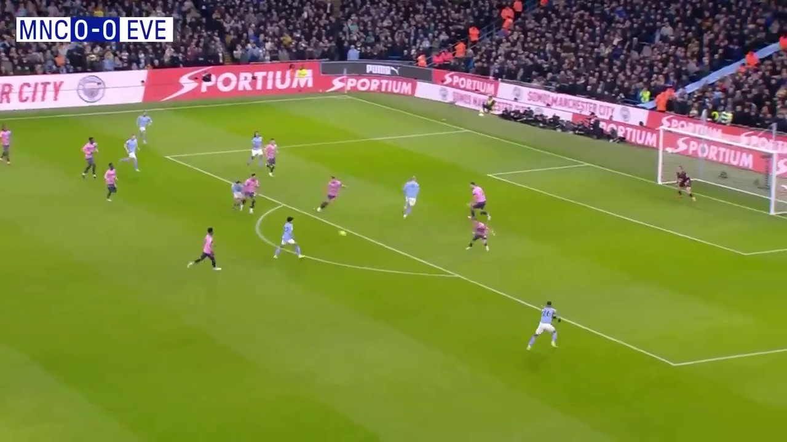

# Football Hawk Eye View

画像から選手の座標データのjsonを返却します。

## Input
サッカーの試合画像


## Output format

```
{"label": "[player | ball]",
  "color": [0~255, 0~255, 0~255], (8種類の色に分類されたRGB値)
  "x": x座標, 
  "y": y座標}
```

## Demo
```
python main.py
```

## 処理の流れ
1. 画像を入力
2. 学習させたYolov5モデルでプレイヤーとボールを検出 
3. チーム判別のために、プレイヤーを検出した場合は、矩形内の色情報をK-Means法を用いて8種類に分類
3. Perspective Transfom モジュールを使用して、射影変換行列を生成
4. 射影変換行列を用いて、検出した選手とボールの座標を上から見た座標に変換
5. ラベル・色・座標データをjson形式で返却